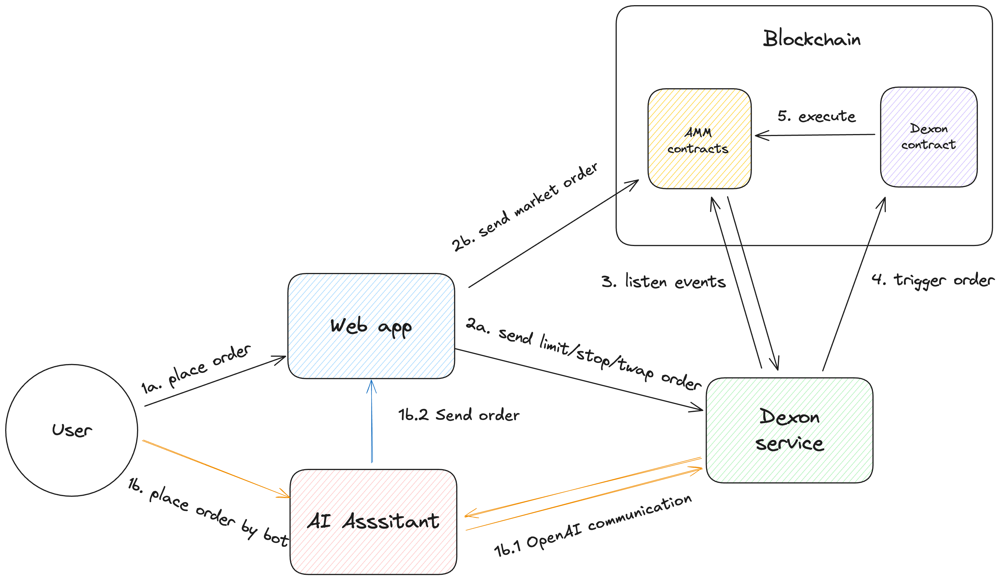

# ZUNI DEXON: Bringing CEX-Level Trading to DeFi With AI Assistance
> @monad-accathon

## Hello superstars ✋, welcome to DEXON, an advanced decentralized exchange platform developed by the ZUNI team! 

## 📚 Documentation
Detailed documentation available at: [HACKMD](https://hackmd.io/@0xdavid7/rkYQt9Noyx)

## 🌟 Overview
DEXON is a comprehensive decentralized exchange platform that combines advanced trading features with AI assistance, built on Monad testnet. It enables secure and efficient trading of digital assets with features like limit orders, stop orders, and TWAP (Time-Weighted Average Price) orders.

## 🏛 System Architecture

DEXON implements a hybrid architecture combining web interfaces, off-chain service, AI assistance, and blockchain integration:

### Components Flow

- User can places order through the web interface. The market orders go directly to the smart contract, while limit, stop, and TWAP orders are submitted to the `dexon-service`. 
- Another path, the AI trading assistant, user provides natural language order placement and price suggestions. The AI assistant validates the order and sends it to the `dexon-service`.
- The `dexon-service` handles order management and execution, integrating with `dexon-contract` for order matching.
- Details: Please visit the [documentation](https://hackmd.io/@0xdavid7/rkYQt9Noyx)

### 🚀 Key Features
- **Multiple Order Types**
  - Market Orders
  - Limit Orders
  - Stop Orders
  - TWAP Orders (Time-Weighted Average Price)
- **AI Trading Assistant**
  - Natural language order placement
  - Intelligent price suggestions
  - Context-aware validation
- **Advanced Trading Features**
  - EIP-712 compliant signatures
  - Price feeds using Uniswap V3 TWAP oracles
  - Multi-hop swaps support
  - Customizable slippage protection

## 🏗 Repository Structure
The DEXON ecosystem consists of four main repositories:

### 1. [dexon-ui](https://github.com/zuni-lab/dexon-ui)
Modern decentralized exchange interface built with:
- Next.js 15
- RainbowKit v2
- Wagmi v2
- Tailwind CSS
- TypeScript

### 2. [dexon-service](https://github.com/zuni-lab/dexon-service)
Backend service handling order management and execution:
- Go-based architecture
- Real-time order matching
- Integration with smart contracts
- OpenAI integration for AI features

### 3. [dexon-contract](https://github.com/zuni-lab/dexon-contract)
Smart contracts powering the DEX:
- Order execution logic
- TWAP implementation
- Price oracle integration
- Built with Foundry

### 4. [dexon-price-tools](https://github.com/zuni-lab/dexon-price-tools)
>> It is not a part of the main components, but it is essential for the DEXON ecosystem.
Price synchronization tool for Monad testnet:
- Syncs prices from Ethereum mainnet
- Supports ETH, BTC, SOL
- Essential for price discovery on Monad testnet
- Ensures accurate order execution

## 🌐 Deployed Contracts
| Network       | Address                                    |
| ------------- | ------------------------------------------ |
| Monad Testnet | 0x45acD584500c747dCE86c77389b3b3B458Eb0A0b |

## 🛠 Getting Started

### Prerequisites
- Node.js 20.x or higher
- Go 1.x
- Foundry
- Bun (recommended) or npm

### Installation
Please refer to individual repository READMEs for specific installation instructions:
1. Clone desired repositories
2. Follow setup instructions in each repository
3. Configure environment variables
4. Start development servers

## Roadmap
1. Implement advanced order types
2. Enhance AI trading assistant
3. Handle large-scale trading volumes
4. Add AI yield farming strategies
5. Integrate with more DeFi protocols
6. Index price feeds from multiple sources

## 🤝 Contributing
We welcome contributions! Please follow these steps:
1. Fork the relevant repository
2. Create your feature branch
3. Commit your changes
4. Push to the branch
5. Create a Pull Request

## 📞 Support
- Email: [0xzuni.lab@gmail.com](mailto:0xzuni.lab@gmail.com)
- Discord: [Join our channel](https://discord.gg/NhUfGfJwah)
- Issues: Use GitHub Issues in respective repositories

## 📄 License
DEXON is open-source software released under the [MIT License](https://opensource.org/licenses/MIT).

Copyright © 2025 ZUNI Laboratory.

